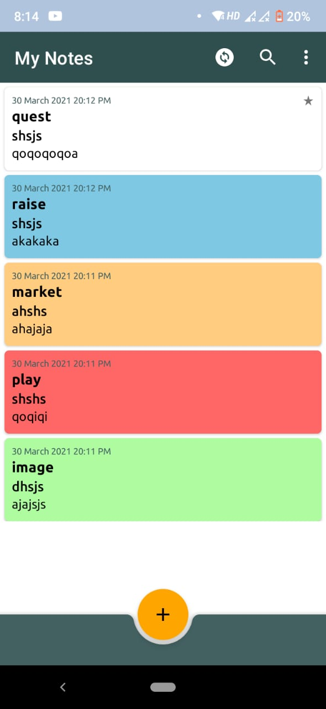
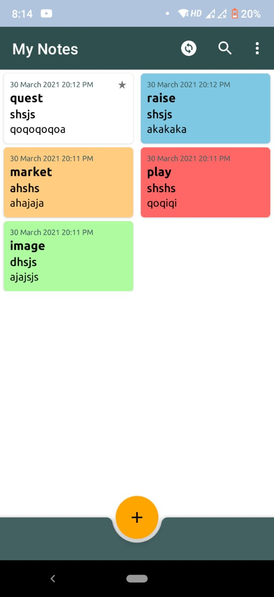
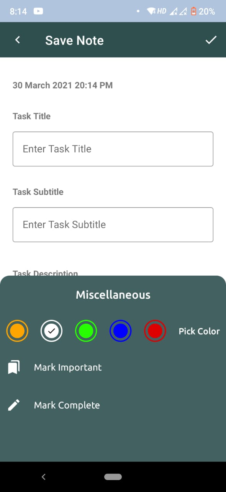
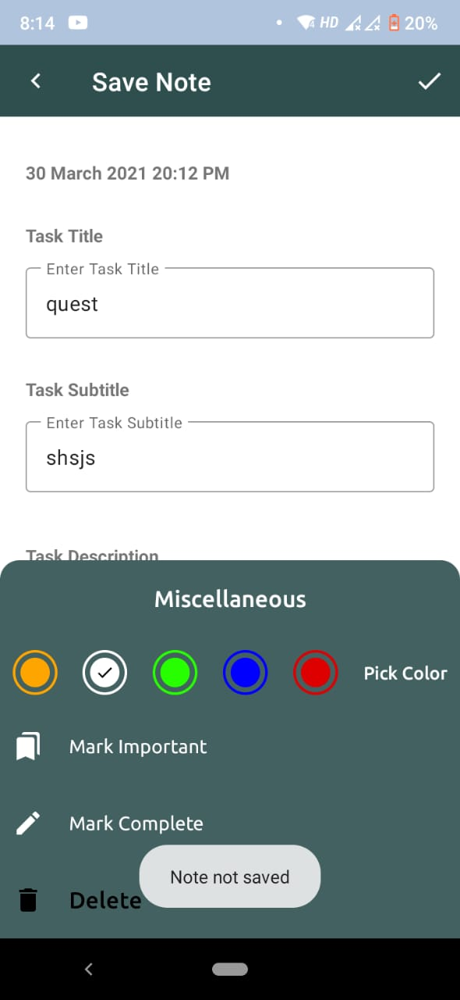

# TasksApp

 |  |  | 

### Library Used
  * Room Persistent - This library provides an abstraction layer over SQLite to allow fluent database access while harnessing the full power of SQLite.

### Android Features Covered
  * Recycler View
  * MVVM Architecture
  * Bottom Sheet
